
## MicroK8s - Provisionando um cluster Data Lake Hadoop no Kubernetes

Será criado de forma rápida e objetiva um cluster Data Lake Hadoop no Kubernetes MicroK8s.

Tudo o que for implementado ou criado na pasta raiz desse tutorial, já ficará disponível dentro do diretório das VMs em:

**/home/vagrant/projeto**

### Versões de softwares utilizados nesse tutorial

SO Windows 11, Vagrant 2.3.3 e VirtualBox 7.0.6

### Requisitos mínimos

- Putty (Software de cliente remoto)

  https://www.chiark.greenend.org.uk/~sgtatham/putty/latest.html

- Ter as imagens docker do Hadoop **Namenode** e **Datanode**.

  No link abaixo mostro como criar.

  https://github.com/tiagotsc/docker-hadoop

- Ter um cluster Kubernetes MicroK8s.

  O cluster que usei nesse tutorial está da seguinte forma.

  3 VMs com CentOS 7, 2 CPUs e 3GB RAM cada, com a seguinte identificação:

  | Hostname   | IP       |
  | :---------- | :--------- |
  | microk8s1 | 192.168.56.150 |
  | microk8s2 | 192.168.56.151 |
  | microk8s3 | 192.168.56.152 |

  Caso não tenha um cluster MicroK8s, no link abaixo mostro como criar.

  https://github.com/tiagotsc/vagrant-microk8s

### Observação

No cluster MicroK8s será usado os recursos de **DNS** e **Load Balance**, portanto ative os no seu cluster:

````bash
# Habilita o gerenciamento e controle de DNS
microk8s enable dns

# Habilita o Load Balance e reserve um range de IP para uso
microk8s enable metallb:192.168.56.200-192.168.56.220
````

### Cluster MicroK8s rodando com os recursos ativados, siga as etapas

Já dentro do seu cluster MicroK8s, no meu caso acessei a VM 192.168.56.150, crie uma pasta, para esse exemplo criei a pasta **projeto**.

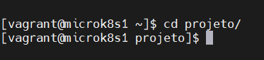

Ela que será usado para armazenar todos os scripts necessários para subir nosso cluster **Hadoop**.

### Siga os passos abaixo para subir no namenode

1 - Crie o arquivo **nn-statefulset.yaml** e adicione o conteúdo abaixo:

https://github.com/tiagotsc/microk8s-hadoop/blob/ddd5cf9b762fd0831099f6138f396995810f8a5f/nn-statefulset.yaml#L1-L51

Substitua o que esta em destaque na figura abaixo pela sua imagem.

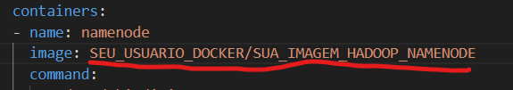

Caso não tenha a imagem, no link abaixo mostro como criar.

https://github.com/tiagotsc/docker-hadoop

Ou, se quiser, você pode usar a imagem que já tenho pronta.

**tiagotsc/hadoop_namenode:3.3.5**

Depois de efetuar as alterações, salve o arquivo.

2 - Vamos subir nosso **Namenode**, execute:

````bash
# Sobe o namenode
kubectl apply -f nn-statefulset.yaml
````

O **namenode** deve demorar um pouco para subir, então vamos acompanhar o processo até o fim, execute:

````bash
# Fica monitorando o que está acontecendo com o pod
kubectl get pods -w -l app=namenode
````

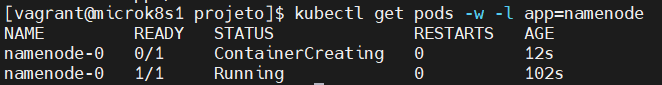

Quando o pod já estiver com status de **Running**, cancele o comando de acompanhamento anterior.

3 - Crie o arquivo **nn-service-internal.yaml**,adicione o conteúdo abaixo e salve:

https://github.com/tiagotsc/microk8s-hadoop/blob/185c2e118bef6cec01dcf4622ae9fa35040d1996/nn-service-internal.yaml#L1-L15

Com esse serviço vamos expor nosso **namenode** internamente no cluster Kubernetes.

4 - Suba o serviço, execute:

````bash
# Cria o serviço
kubectl apply -f nn-service-internal.yaml
````

5 - Vamos criar mais um serviço, crie o arquivo **nn-service-loadbalance.yaml**, adicione o conteúdo abaixo e salve:

https://github.com/tiagotsc/microk8s-hadoop/blob/185c2e118bef6cec01dcf4622ae9fa35040d1996/nn-service-loadbalance.yaml#L1-L10

Esse serviço será o responsável por expor o **namenode** externamente para que possamos acessar o painel do cluster Hadoop.

5 - Suba o serviço, execute:

````bash
# Cria o serviço
kubectl apply -f nn-service-loadbalance.yaml
````
6 - Vamos iniciar nosso **namenode**, execute:

````bash
# Entre no container
kubectl exec -it namenode-0 -- /bin/bash

# Mude para o hduser
su hduser

# Formate o namenode (somente na primeira execução)
hdfs namenode -format

# Inicie o namenode
hdfs --daemon start namenode
````

7 - Já foram do **namenode**, vamos pegar o **IP** do serviço **load balance** para poder acessar nosso **namenode** externamente, execute:

````bash
# Listar serviços com detalhes
kubectl get services -o wide
````

No meu caso, o **IP** de acesso externo, está em destaque na imagem abaixo.

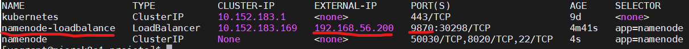

8 - Pegue o **IP** e jogue no navegador da seguinte forma:

http://IP_PEGO:9870

Se tudo ocorrer bem, você deve conseguir ver a seguinte tela.

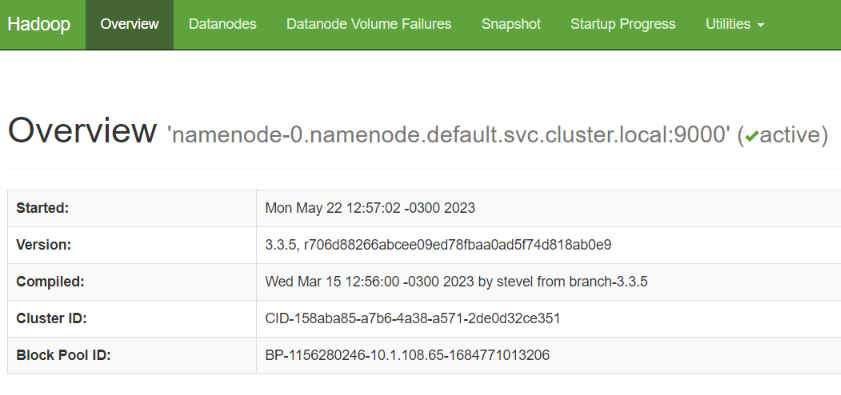

Namenode está tudo ok, vamos agora para os datanodes.

### Siga os passos abaixo para subir os datanodes

#### Observação

Antes de prosseguir com os **datanodes** precisaremos da chave pública ssh do **namenode**, portanto execute:

````bash
# Pega chave ssh
kubectl exec namenode-0 -- cat /home/hduser/.ssh/authorized_keys
````

Guarde essa chave, pois ela será usado posteriormente.

1 - Crie o arquivo **dn-statefulset.yaml** e adicione o conteúdo abaixo:

https://github.com/tiagotsc/microk8s-hadoop/blob/185c2e118bef6cec01dcf4622ae9fa35040d1996/dn-statefulset.yaml#L1-L46

Substitua o que esta em destaque na figura abaixo pela sua imagem.

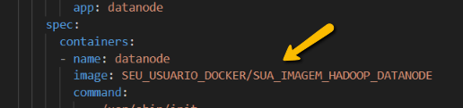

Caso não tenha a imagem, no link abaixo mostro como criar.

https://github.com/tiagotsc/docker-hadoop

Ou, se quiser, você pode usar a imagem que já tenho pronta.

**tiagotsc/hadoop_namenode:3.3.5**

Coloque também dentro desse arquivo a chave SSH que tinha sido obtida anteriormente.

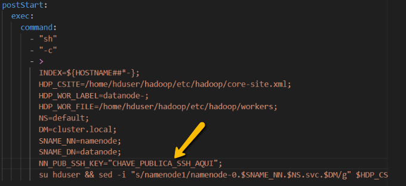

Depois de efetuar as alterações, salve o arquivo.

2 - Vamos subir nosso **Datanode**, execute:

````bash
# Sobe o datanode
kubectl apply -f dn-statefulset.yaml
````

O **datanode** deve demorar um pouco para subir, então vamos acompanhar o processo até o fim, execute:

````bash
# Fica monitorando o que está acontecendo com o pod
kubectl get pods -w -l app=datanode
````

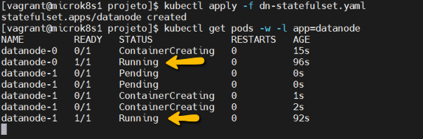

Quando o pod já estiver com status de **Running**, cancele o comando de acompanhamento anterior.

Nesse exemplo subi 2 pods **datanodes**.

3 - Crie o arquivo **dn-service-internal.yaml**,adicione o conteúdo abaixo e salve:

https://github.com/tiagotsc/microk8s-hadoop/blob/185c2e118bef6cec01dcf4622ae9fa35040d1996/dn-service-internal.yaml#L1-L15

Com esse serviço vamos expor nossos **datanodes** internamente no cluster Kubernetes.

4 - Suba o serviço, execute:

````bash
# Cria o serviço
kubectl apply -f dn-service-internal.yaml
````

5 - Vamos iniciar os **datanodes**, em cada um, execute:

Observação: Só não esqueça de mudar o nome do datanode de acordo com qual deseja acessar.

````bash
# Acesse o datanode-0, por exemplo
kubectl exec -it datanode-0 -- /bin/bash

# Mude para usuário hduser
su hduser

# Inicia o datanode-0, por exemplo
hdfs --daemon start datanode
````

Execute os comandos acima para cada **datanode** que você criar.

6 - Vamos criar serviços **load balance** para poder ter acesso externo e individual a cada **datanode**.

````bash
# Cria serviço para cada pod individualmente
for i in `kubectl get pod --selector="app=datanode" -n default -o jsonpath='{range .items[*]}{.metadata.name}{"\n"}{end}'`; do kubectl expose pod "$i" --name="$i" --type="LoadBalancer" --port=9864; done
````

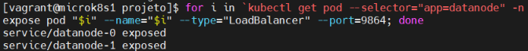

Abaixo é possível ver os serviços criados com o comando anterior.

````bash
# Lista serviços criados para os datanodes
kubectl get services --selector="app=datanode"
````

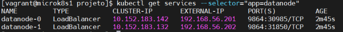

Esse serviço será o responsável por expor os **datanodes** externamente para que possamos acessa los através do painel do cluster Hadoop.

7 - Obtenha a lista de DNS e IPs externos para acessar cada **datanode**.

````bash
# Pega o ip externo junto com DNS para montar arquivo host
kubectl get service --selector="app=datanode" -n default -o jsonpath='{range .items[*]}{.status.loadBalancer.ingress[*].ip} {.metadata.name}.datanode.default.svc.cluster.local{"\n"}{end}'
````

Copie o conteúdo (IPs e DNS) do comando anterior e cole no arquivo **hosts** do seu SO e salve.

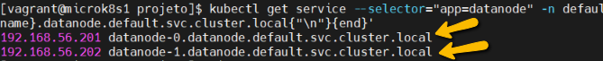

- No **Windows**, esse arquivo fica em:
  
  C:\Windows\System32\drivers\etc\hosts

- No **Linux**, esse arquivo fica em:

  /etc/hosts

8 - Se tudo ocorreu bem, atualize o painel do Hadoop e clique no menu "datanodes".

http://IP_PEGO:9870

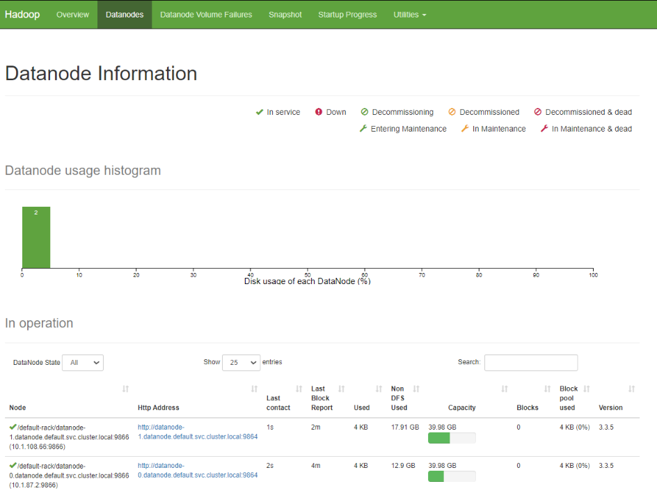

Ao clicar em um dos **datanodes**, você poderá ver mais detalhes a respeito do estado de cada nó.

#### Concluiu todo o passo a passo e desejava remover os recursos criados, execute os comandos abaixo:

````bash
# Deleta todos os serviços load balance para todos os datanodes
for i in `kubectl get pod --selector="app=datanode" -n default -o jsonpath='{range .items[*]}{.metadata.name}{"\n"}{end}'`; do kubectl delete service "$i"; done

# Deleta o serviço interno datanode
kubectl delete service datanode

# Deleta statefulset do datanode
kubectl delete statefulset datanode

# Deleta o serviço load balance namenode
kubectl delete service namenode-loadbalance

# Deleta o serviço interno namenode
kubectl delete service namenode

# Deleta statefulset do namenode
kubectl delete statefulset namenode
````

Todo o tutorial aplicado aqui, já se encontra pronto para uso nesse repositório, se você tiver em seu SO o **Vagrant** e **VirtualBox**, basta clonar, subir o ambiente e ir aplicando os recursos no **Kubernetes**.

O passo a passo foi desenvolvido encima do **Vagrant 2.3.3** e **VirtualBox 7.0.6**.

## Alguns comandos úteis e dicas

```bash
##### MicroK8s - Execute dentro de cada VM #####

# Para o nó
microk8s stop

# Inicia o nó, caso esteja parado
microk8s start

# Visualizar status do nó e extensões
microk8s status

# Desativa o nó, execute esse comando dentro do nó que deseja desativar
microk8s leave

# Depois que o nó já está desativado, de um nó ativo, remova o nó desativado de fato do cluster
microk8s remove-node IP_NÓ ou HOSTNAME_NÓ

##### KUBERNETES #####

# Sobe recurso através do arquivo informado
kubectl apply -f NOME_ARQUIVO.YAML

# Assistir em tempo real criação, atualização de determinado recurso
kubectl get pods -w -l app=NOME_RECURSO

# Deletar recurso
kubectl delete TIPO_RECURSO NOME_DADO_AO_RECURSO

# Caso queira obter a lista de um recurso
kubectl get TIPO_RECURSO
ou
kubectl get TIPO_RECURSO	NOME_DADO_AO_RECURSO # Para listar 1 em específico

# Obtendo a lista de pods com mais detalhe
kubectl get pods -o wide

# Obter informações detalhadas do pod
kubectl describe pods NOME_POD

# Ver log do pod
kubectl logs NOME_POD

# Acessar container do pod
kubectl exec -it NOME_POD --container NOME_CONTAINER -- /bin/bash

##### LINUX #####

# Verificar se determinada porta está em uso
sudo lsof -i:NUMERO_PORTA

# Matar processo que está fazendo uso da porta
sudo kill -9 $(sudo lsof -t -i:NUMERO_PORTA)

##### VAGRANT - é preciso estar na pasta que contém o Vagrantfile #####

# Desliga VMs
vagrant up

# Reiniciar VMs
vagrant reload

# Destruir VMs, peguntando antes
vagrant destroy

# Destruir VMs, direto sem perguntar
vagrant destroy -f

##### HADOOP NAMENODE - Pode ser executado: #####
# Deve ser executado dentro do container do pod (kubectl exec -it namenode-0 -- /bin/bash)

# Formata o Namenode
hdfs namenode -format

# Inicia o Namenode
hdfs --daemon start namenode

# Para o Namenode
hdfs --daemon stop namenode

# Verificar se o serviço está rodando
jps

# Inicia todo o cluster Hadoop, Namenode + Datanodes associados
$HADOOP_HOME/sbin/start-dfs.sh ou $HADOOP_HOME/sbin/start-all.sh

# Parar todo o cluster Hadoop, Namenode + Datanodes associados
$HADOOP_HOME/sbin/stop-dfs.sh ou $HADOOP_HOME/sbin/stop-all.sh

# Se tiver problemas com algum namenode, você pode executar (Cuidado! esse comandos apagam dados)
hdfs --daemon stop namenode
rm -Rf /tmp/hadoop-hduser-namenode.pid 
rm -Rf /home/hduser/hadoop/logs
rm -Rf /home/hduser/hdfs/namenode/*
hdfs namenode -format
hdfs --daemon start namenode

##### HADOOP DATANODE - Pode ser executado: #####
# Deve ser executado dentro do container do pod (kubectl exec -it datanode-0 -- /bin/bash)

# Inicia o Datanode
hdfs --daemon start datanode

# Para o Datanode
hdfs --daemon stop datanode

# Verificar se o serviço está rodando
jps

# Se tiver problemas com algum datanode, você pode executar (Cuidado! esse comandos apagam dados)
hdfs --daemon stop datanode
rm -Rf /tmp/hadoop-hduser-datanode.pid 
rm -Rf /home/hduser/hadoop/logs
rm -Rf /home/hduser/hdfs/datanode/*
hdfs --daemon start datanode
```

#### Documentação oficial do Vagrant

https://developer.hashicorp.com/vagrant/docs

#### Documentação oficial do MicroK8s

https://microk8s.io/docs

#### Documentação oficial do Hadoop 3.3.5

https://hadoop.apache.org/docs/r3.3.5/

## 🔗 Links
[](https://www.linkedin.com/in/tiago-s-costa)